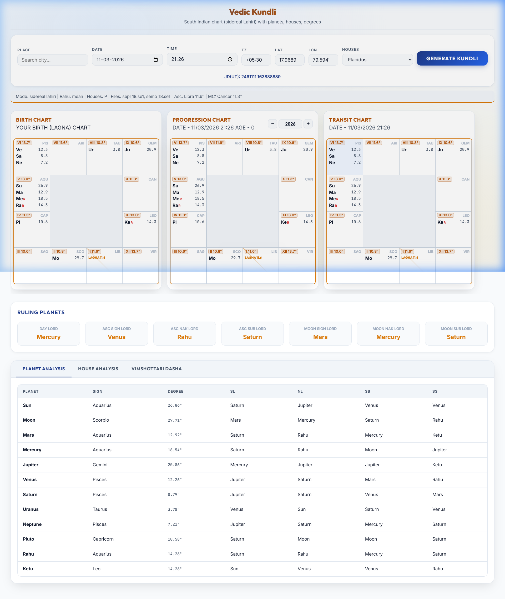

# Kundli Generator (Desktop App)

This is a standalone desktop application that generates a Kundli using **Swiss Ephemeris `.se1` files** located in `./ephe`. It runs as a self-contained window with dynamic port management, ensuring it starts reliably every time.

## How to Run (Windows)

The simplest way to use the application is with the provided starter script:

1. **Double-click `run_app.bat`** in the project folder.
2. The script will automatically:
   - Verify/Create your local environment.
   - Install all necessary dependencies.
   - Find an available port on your system.
   - **Launch the application in its own desktop window.**

No browser is required, and no manual URL entry is needed.

## Features

- **Portless Experience**: Automatically detects conflict-free ports.
- **Standalone Window**: Native desktop feel using `pywebview`.
- **9 Planets**: Sun, Moon, Mars, Mercury, Jupiter, Venus, Saturn, **Rahu**, **Ketu**.
- **12 House Cusps**: Accurate degrees and sign calculations.
- **Technical Accuracy**: Powered by Swiss Ephemeris data files.

## Technical Notes

- **Zodiac**: Defaults to **Sidereal (Lahiri)**.
- **Rahu/Ketu**: Rahu can be Mean or True node; Ketu is computed as Rahu + 180 degrees.
- **House System**: Defaults to Placidus (`P`) but configurable in the interface.
- **Performance**: Uses a high-performance Windows DLL (`swedll64.dll`) for instant calculations.

## License

Swiss Ephemeris is subject to its own license terms (see `vendor/swe/LICENSE`).
